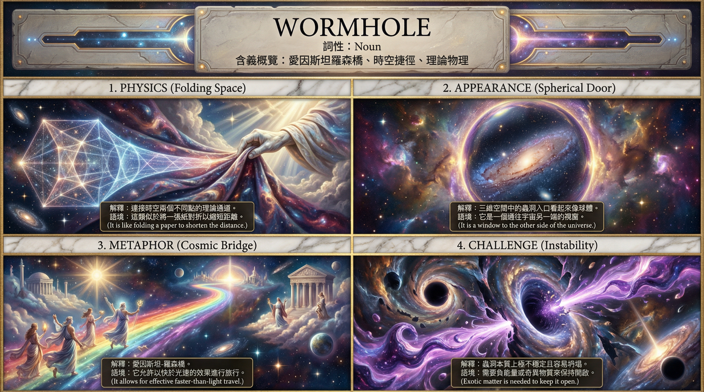
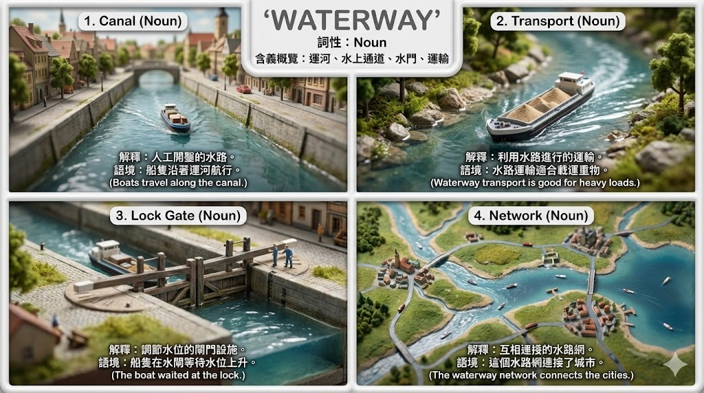
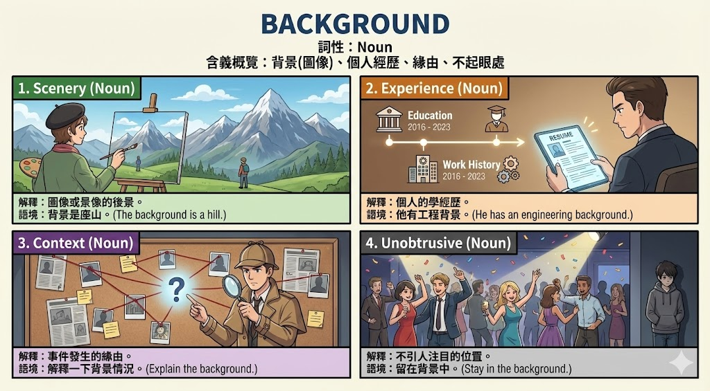
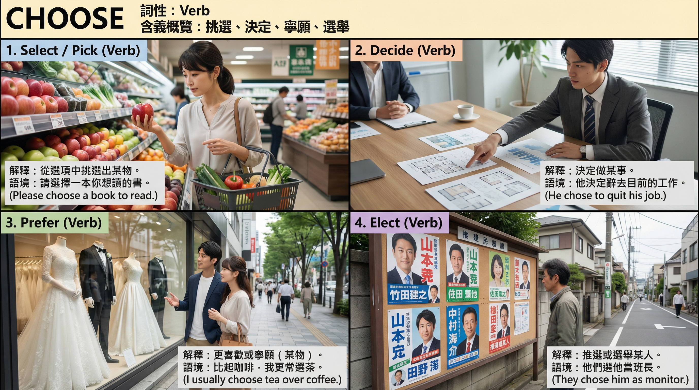

### Vocab_Card_Prompts

A specialized collection of JSON prompt frameworks designed for AI image generation models to create 4-panel educational vocabulary cards.

[English](#english) | [中文](#中文)

## English

### Features

3 Distinct Art Styles: Covers American Textbook (Formal/Vector), Japanese Anime (Cel-shaded/Vibrant), and American Comic (Bold Ink/Dramatic).

Stable Infographic Architecture: All prompts utilize an "Infographic Anchor" logic to ensure text legibility and strict layout adherence.

Bilingual Optimization: Enforces strictly formatted Traditional Chinese definitions (< 12 chars) and English context sentences.

Structured JSON Output: Generates valid JSON objects ready for integration with Banana Pro or other stable diffusion pipelines.

Automated Content Analysis: The prompts instruct the LLM to act as a linguist, analyzing the top 4 distinct definitions of any input word.

Style Gallery

[American Textbook](prompts/american-textbook.txt) 

[American Comic](prompts/american-comicV2.txt)  

[Japanese Anime](prompts/japanese-anime.txt) 

***Preview***
| Wormhole View | Waterway View |
| :---: | :---: |
|  |  |

| Voltage View | Trade route View |
| :---: | :---: |
|  |  |

| Ball View | Background View |
| :---: | :---: |
|  |  |

| 教王護国寺(東寺) View | 本多 忠勝 View |
| :---: | :---: |
|  |  |

| Choose View | 犬山城 View |
| :---: | :---: |
|  |  |

### How to Use

Select a Style: Choose a text file from the prompts/ directory (e.g., prompts/japanese-anime.txt).

Input to LLM: Copy the entire content of the file into an LLM (Gemini, ChatGPT, Qwen, etc.).

Provide a Word: Type the English vocabulary word you wish to visualize (e.g., "Access").

Generate JSON: The LLM will output a JSON code block.

Create Image: Paste the JSON content into your Banana Pro or Stable Diffusion interface to generate the vocabulary card.

It is recommended to upload a reference image as a layout template for each generation. 

Please name this file Actor.jpg to match the default prompt settings. 

If you use a different filename, ensure you update the reference name within the prompt accordingly.

### Syntax Guide

- [Prompt Structure Guide](guide/prompt-structure.md)

### Legal Disclaimer 

- The content provided in this project is strictly for the purpose of demonstrating prompt engineering techniques.
- We do not encourage or endorse the unauthorized use of copyrighted or licensed materials.
- Users are solely responsible for verifying the usage rights of any images or content generated or utilized via this project.
- The creator of this project disclaims all liability for any damages or legal consequences arising from the user's violation of copyright laws.

### License

This project is released under the [MIT License](LICENSE).

## 中文

 AI生圖模型設計的JSON提示詞架構集合，用於生成高品質的「四格單字記憶卡」。 

[View this document in English](#english)

### 功能特色

三種風格: 涵蓋 美式課本 (正式/向量風格)、日系動漫 (賽璐珞/鮮豔) 與 美式漫畫 (粗墨線/戲劇張力)。

穩定的資訊圖表架構: 所有提示詞皆採用「Infographic Anchor (資訊圖表錨點)」邏輯，確保版面工整與文字清晰度。

雙語優化設計: 強制規範繁體中文釋義（12 字以內）與英文語境的分行顯示，提升閱讀體驗。

標準化 JSON 輸出: 產出格式嚴謹的 JSON 物件，可直接應用於 Banana Pro 或 Stable Diffusion 自動化流程。

自動化內容分析: 提示詞內建語言學家角色設定，能自動分析輸入單字的四大核心義項與語境。

### 提示詞快捷

[`View Prompts / 查看提示詞`](./prompts)

### 如何使用

選擇風格: 從 prompts/ 資料夾中選擇一個文字檔（例如 prompts/japanese-anime.txt）。

輸入至 LLM: 將檔案內的完整內容複製並貼上至 LLM (Gemini, ChatGPT, Qwen 等)。

提供單字: 輸入您想要視覺化的英文單字（例如："Access"）。

獲取 JSON: LLM 將會自動生成一段 JSON 程式碼。

生成圖片: 將該 JSON 內容貼入 Banana Pro 或 Stable Diffusion 介面中即可生成單字卡。

建議每次生成時，上傳一張參考圖片作為構圖模板（Layout Template）。

請將該圖片命名為 Actor.jpg 以匹配 Prompt 的預設設定；若您使用其他檔名，請務必同步修改 Prompt 內對應的參照名稱。

### 語法教學

- [提示詞架構指南 / Prompt Structure Guide](guide/prompt-structure.md)

### 法律免責聲明 

- 本專案所提供之內容嚴格限制於展示 Prompt 工程技術。我們不鼓勵也不支持任何未經授權使用受版權或授權保護素材之行為。
- 使用者須自行確認並承擔透過本專案生成或使用之任何圖片與內容的使用權利。 對於使用者因違反版權法規而導致的任何損害或法律後果，本專案開發者不承擔任何責任。

授權條款

### 本專案採用 [MIT License](LICENSE) 授權。
